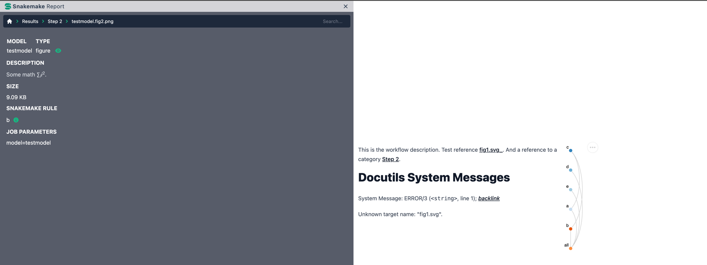
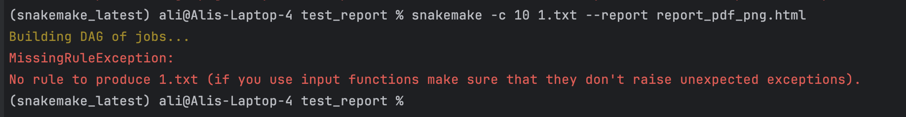

# 26th Feb 2024 @ 00:06:46

The data files that are downloaded by the command given does not seem to be correct. Also it is not similar to the tree mentioned in the documentation. It gives the following error:


```
(snakemake) ali@ali-MS-7C02:/media/ali/Data/MPRAsnakeflow/resources/combined_basic$ snakemake -c 1 --use-conda --snakefile ../../workflow/Snakefile --configfile config.yml -n
Building DAG of jobs...
MissingInputException in rule counts_umi_create_BAM in file /media/ali/Data/MPRAsnakeflow/workflow/rules/counts/counts_umi.smk, line 9:
Missing input files for rule counts_umi_create_BAM:
    output: results/experiments/countBasic/counts/useUMI.HEPG2_1_RNA.bam
    wildcards: project=countBasic, condition=HEPG2, replicate=1, type=RNA
    affected files:
        data/SRR10800882_1.fastq.gz
        data/SRR10800882_2.fastq.gz
        data/SRR10800882_3.fastq.gz
```


# 27th Feb 2024 @ 23:1937

When downloaded the SRA file for the combined workflow the download result  was like as follow. 

```
(snakemake) ali@ali-MS-7C02:~/Documents/MPRAsnakeflow/resources/combined_basic/data$ prefetch SRR10800986

^[[D2024-02-27T21:38:23 prefetch.3.0.10: Current preference is set to retrieve SRA Normalized Format files with full base quality scores.                                                                                                      2024-02-27T21:38:24 prefetch.3.0.10: 1) Downloading 'SRR10800986'...
2024-02-27T21:38:24 prefetch.3.0.10: SRA Normalized Format file is being retrieved, if this is different from your preference, it may be due to current file availability.
2024-02-27T21:38:24 prefetch.3.0.10:  Downloading via HTTPS...                                                       2024-02-27T21:57:23 prefetch.3.0.10:  HTTPS download succeed
2024-02-27T21:57:41 prefetch.3.0.10:  'SRR10800986' is valid
2024-02-27T21:57:41 prefetch.3.0.10: 1) 'SRR10800986' was downloaded successfully
2024-02-27T21:57:41 prefetch.3.0.10: 'SRR10800986' has 0 unresolved dependencies
(snakemake) ali@ali-MS-7C02:~/Documents/MPRAsnakeflow/resources/combined_basic/data$ 

```

# 20th March 2024 @ 15:44:46
Embedding problem is still, with the latest version of the snakemake file. 


I also tried the small report but got the following error:


# 16th Apr 2024 @ 16:19:18
I'm currently developing unit tests for files within the MPRAsnakeflow pipeline, specifically focusing on the BAM file. The primary objective is to establish a comprehensive suite of tests that target critical aspects of the BAM file. These tests serve a crucial role in ensuring the stability and integrity of the BAM file across different tool implementations. By verifying essential attributes and functionalities, I want to facilitate seamless integration of alternative tools for optimizing various pipeline steps. Assuming that BAM files generated by different tools could be similar but not identical (so that we can not do bit by bit comparison)

Could you please advise on the key elements and functionalities that should be prioritized for testing a BAM file to ensure its robustness and compatibility?

Ans:not sure how general such a test needs to be or how useful it is. Testing consistency/integrity of BAM files, one could argue is a task for the library parsing BAM -- i.e. pysam -- and should always be runtime error. This would for example include the check for the EOF marker, a check for compression check sums or that fields are used as specified. 
Unit tests are supposed to check that the code is still consistent after edits. If you want one on for BAM files, I think it would be specific to each tool writing BAM. For example the read merging step creates BAM files with the 2 or 4 of the custom fields XI, XJ, ZI, ZJ (not completely sure whether it was Z or Y). These fields have the UMI in the counting pipeline and are therefore required by the next script. Similarly, in the association step, they have the barcode and are also required by the next step. So in principle you could write a unit test, checking for the presence of such tags. However, this test could/should also check whether the number of input sequences relates correctly to the number of outputs in BAM format (are specified quality filters correctly applied, are sequences trimmed, or otherwise modified when requested by program parameters). In principle, you can do some black box testing here (i.e. have a defined input file that you manually create and an expected previously checked output file with which you compare the current script output) and even do such check simply on identity of output file and previously checked "template". In the case of the binary BAM format and potential differences in compression library versions or other version differences, I would recommend to export BAM to SAM (samtools view) and compare the textual outputs of an expected and a newly obtained BAM/SAM.

Hi Martin, 

Thank you so much for the detailed response on my previous question. I am trying to do the suggested optimization:

"Rule counts_umi_create_BAM identified by Ali
Max suggests that read merging is the culprit
ngMerge, bbMerge, PEAR
note that programs are optimized for longer read merging, while we are dealing with 15bp here -- default parameters of existing tools need to be adjusted"

I have gone searched the web for details about these files and the read merge step. 

I have also checked the following files related to this rule `counts_umi_create_BAM`:

https://github.com/bioinformaticsguy/MPRAsnakeflow/blob/development/workflow/rules/counts/counts_umi.smk
https://github.com/bioinformaticsguy/MPRAsnakeflow/blob/development/workflow/scripts/count/MergeTrimReads_python3.py
https://github.com/bioinformaticsguy/MPRAsnakeflow/blob/development/workflow/scripts/count/MergeTrimReadsBAM_python3.py

I am a little bit confused where to start, because these scripts are long and a little bit hard to follow, I was assuming that we can swap between these tools (ngMerge, bbMerge, PEAR) to do a specific step, so that we can use a better tool to so the same job in less time.

I would be grateful for a little guidance on where to start, and how to approach this problem.